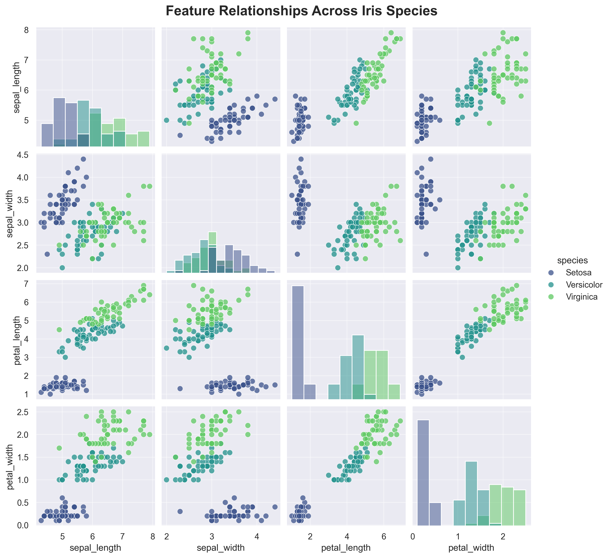
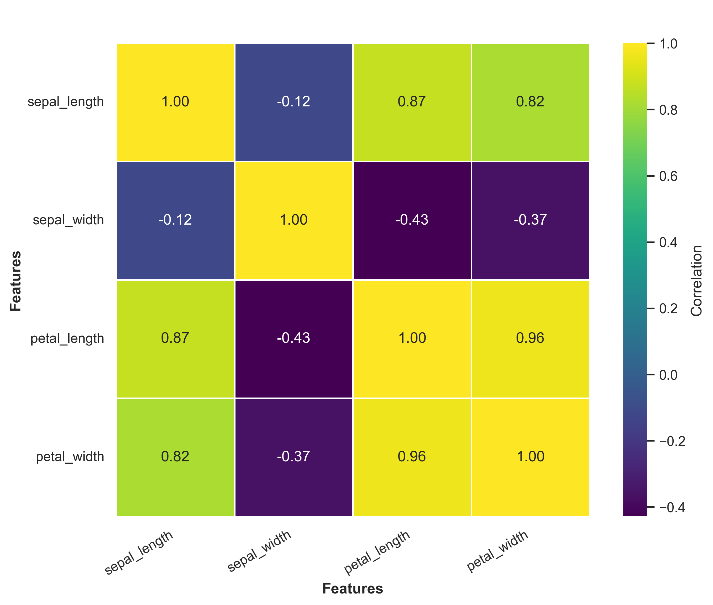
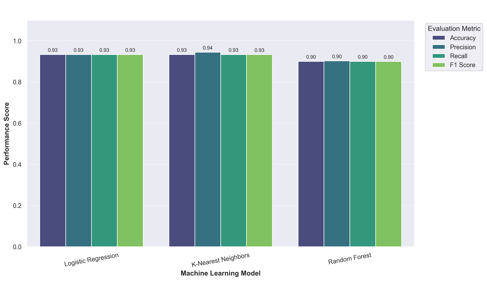
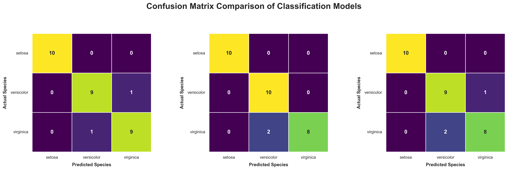

# 🌸 Iris Flower Classification

<div align="center">

## Oasis Infobyte — Data Science Internship

### 📊 Task 1: Iris Flower Classification

**👨‍💻 Author:** Himanshu Chavda


</div>

---

# 📑 Table of Contents

- Project Overview
- Objective
- Dataset Information
- Machine Learning Workflow
- Technologies Used
- Exploratory Data Analysis
- Machine Learning Models
- Evaluation Metrics
- Project Structure
- Results
- Key Insights
- Future Improvements
- How to Run
- Author

---

# 📌 Project Overview

This project develops Machine Learning classification models that
predict the species of an Iris flower using its physical
measurements.

The complete Machine Learning pipeline includes:

- 📥 Dataset Loading
- 📊 Exploratory Data Analysis
- 🧹 Data Quality Analysis
- 📈 Data Visualization
- 🎯 Feature Analysis
- ✂️ Train-Test Split
- ⚙️ Feature Scaling
- 🤖 Model Training
- 📉 Model Evaluation
- 📋 Model Comparison
- 🏆 Best Model Selection
- 🌸 Sample Prediction

---

# 🎯 Objective

The objective is to classify Iris flowers into one of the following
species:

- 🌸 Setosa
- 🌸 Versicolor
- 🌸 Virginica

using the following flower measurements:

- Sepal Length
- Sepal Width
- Petal Length
- Petal Width

---

# 📂 Dataset Information

The dataset is available directly from:

```python
from sklearn.datasets import load_iris
```

No external download is required.

| Property | Value |
|----------|-------|
| Samples | 150 |
| Features | 4 |
| Classes | 3 |
| Missing Values | 0 |

---

# 🔬 Machine Learning Workflow

```text
Load Dataset
      │
      ▼
Exploratory Data Analysis
      │
      ▼
Data Visualization
      │
      ▼
Feature Analysis
      │
      ▼
Train-Test Split
      │
      ▼
Feature Scaling
      │
      ▼
Train ML Models
      │
      ▼
Model Evaluation
      │
      ▼
Compare Performance
      │
      ▼
Best Model Selection
      │
      ▼
Prediction
```

---

# 🛠️ Technologies Used

| Technology | Purpose |
|------------|---------|
| Python | Programming Language |
| Pandas | Data Analysis |
| NumPy | Numerical Computing |
| Matplotlib | Visualization |
| Seaborn | Statistical Visualization |
| Scikit-Learn | Machine Learning |
| Jupyter Notebook | Development Environment |

---

# 📊 Exploratory Data Analysis

The notebook performs:

- ✅ Dataset Inspection
- ✅ Shape Analysis
- ✅ Data Types
- ✅ Missing Value Analysis
- ✅ Duplicate Check
- ✅ Descriptive Statistics
- ✅ Species Distribution
- ✅ Pairplot
- ✅ Boxplots
- ✅ Correlation Heatmap

---

# 🤖 Machine Learning Models

The following classification models were implemented.

### 1️⃣ Logistic Regression

A linear classification algorithm used as the baseline model.

---

### 2️⃣ K-Nearest Neighbors (KNN)

A distance-based classification algorithm that predicts classes
using neighboring samples.

---

### 3️⃣ Random Forest

An ensemble learning algorithm using multiple decision trees for
robust predictions.

---

# 📈 Evaluation Metrics

The models were evaluated using:

- Accuracy
- Precision
- Recall
- F1-Score
- Confusion Matrix

---

# 📁 Project Structure

```text
DataScience-Task1-IrisFlowerClassification/
│
├── notebook/
│   └── iris_flower_classification.ipynb
│
├── data/
│
├── images/
│   ├── species_distribution.png
│   ├── iris_pairplot.png
│   ├── iris_boxplots.png
│   ├── correlation_heatmap.png
│   ├── model_comparison.png
│   ├── confusion_matrices.png
│   └── feature_importance.png
│
├── outputs/
│   └── model_comparison.csv
│
├── requirements.txt
│
└── README.md
```

---

# 📷 Project Visualizations

Add screenshots from the notebook here after saving your plots.

Example:

```markdown







```

GitHub will automatically display these images.

---

# 📈 Results

Three Machine Learning classification models were trained and
evaluated:

- Logistic Regression
- K-Nearest Neighbors (KNN)
- Random Forest

The models were evaluated using:

- Accuracy
- Precision
- Recall
- F1-Score
- Confusion Matrix

### 🏆 Best Performing Model

**Logistic Regression**

**F1-Score: 0.9333**

Logistic Regression achieved the highest overall F1-score among
the evaluated models and was therefore selected as the
best-performing model for this classification task.

The complete model comparison and classification reports are
available in the Jupyter Notebook.

---

# 💡 Key Insights

- The Iris dataset contains 150 samples and 4 numerical features.
- The dataset contains no missing values.
- Setosa is highly distinguishable from Versicolor and Virginica.
- Petal length and petal width provide strong separation between
  the three species.
- Three classification algorithms were compared.
- Logistic Regression achieved the best overall F1-score.
- The best-performing model achieved an F1-score of **0.9333**.
- Confusion matrices were used to analyze correct and incorrect
  predictions for each species.
  
---

# 🚀 Future Improvements

Possible future enhancements include:

- Hyperparameter Tuning
- Cross Validation
- Additional Classification Models
- Model Deployment using Streamlit
- REST API Deployment using FastAPI

---

# ▶️ How to Run

Clone the repository:

```bash
git clone YOUR_GITHUB_REPOSITORY_URL
```

Open the project folder:

```bash
cd DataScience-Task1-IrisFlowerClassification
```

Install dependencies:

```bash
pip install -r requirements.txt
```

Launch Jupyter Notebook:

```bash
jupyter notebook
```

Open:

```text
notebook/iris_flower_classification.ipynb
```

Run all cells from top to bottom.

---

# 👨‍💻 Author

**Himanshu Chavda**

Data Science • Machine Learning • Artificial Intelligence

---

# 📌 Internship

This project was completed as part of the **Oasis Infobyte Data Science Internship Program**.

⭐ If you found this project useful, consider giving the repository a star.