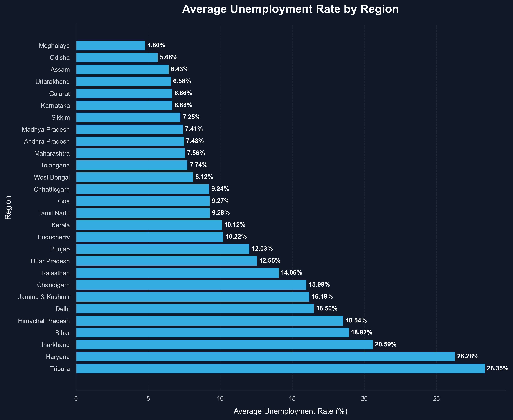
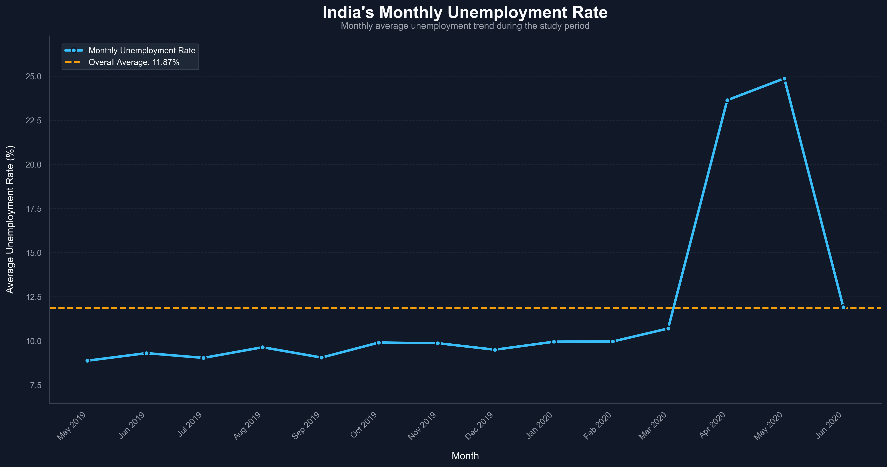
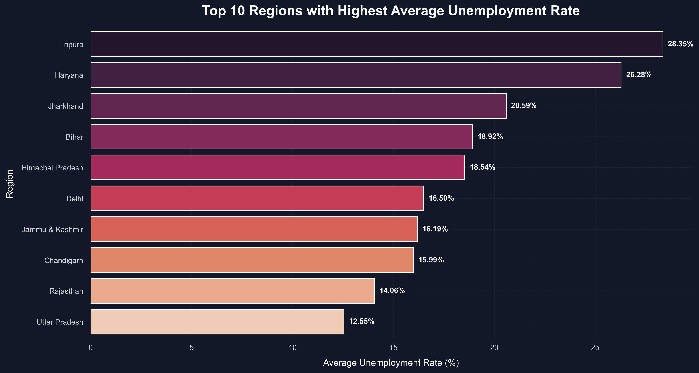
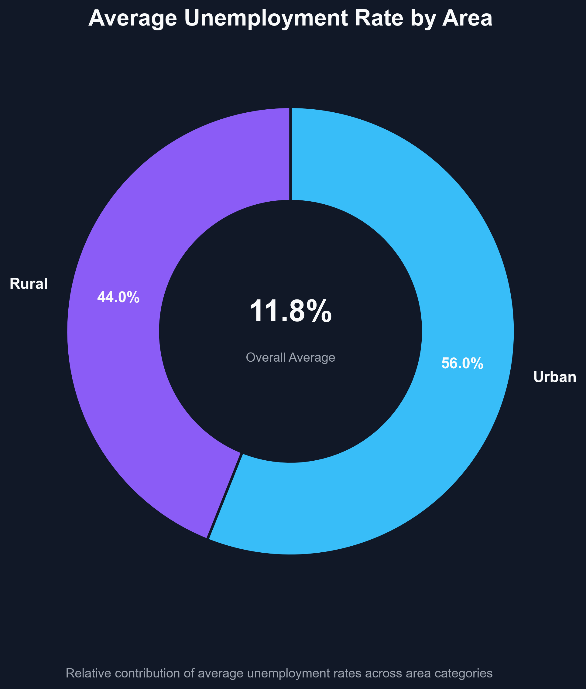
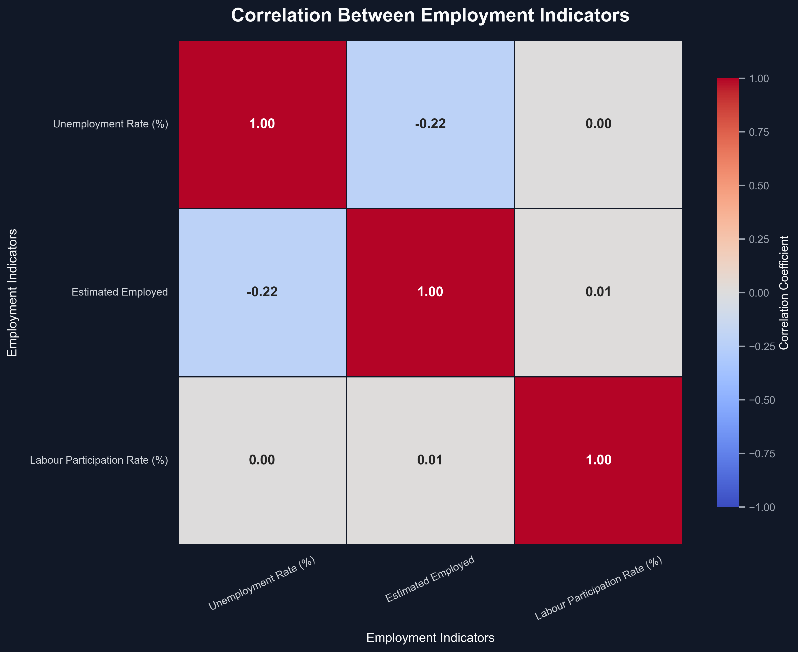
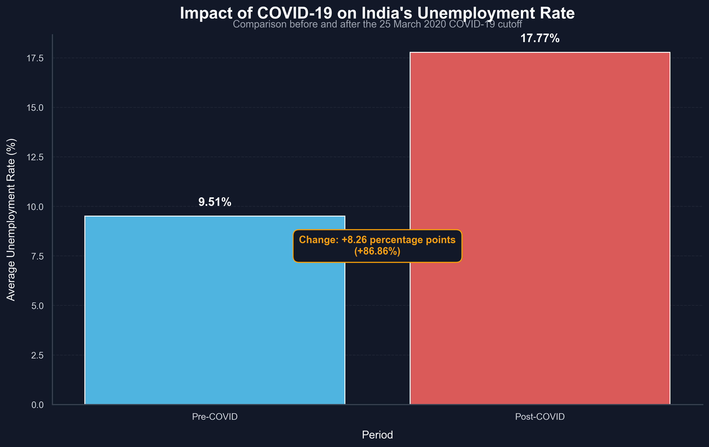

# 📊 Unemployment Analysis with Python

<div align="center">

## Oasis Infobyte — Data Science Internship

### 📈 Task 2: Unemployment Analysis with Python

**👨‍💻 Author:** Himanshu Chavda


</div>

---

# 📑 Table of Contents

- Project Overview
- Objective
- Dataset Information
- Project Workflow
- Technologies Used
- Exploratory Data Analysis
- Visualizations
- COVID-19 Impact Analysis
- Project Structure
- Results
- Key Insights
- Future Improvements
- How to Run
- Author

---

# 📌 Project Overview

This project performs an in-depth **Exploratory Data Analysis (EDA)** on unemployment data in India using Python.

The notebook investigates unemployment trends across different states and regions, labour participation, employment levels, urban-rural differences, and the impact of the COVID-19 pandemic through statistical analysis and professional visualizations.

The complete analysis pipeline includes:

- 📥 Dataset Loading
- 🧹 Data Cleaning
- 🔍 Data Inspection
- 📊 Exploratory Data Analysis
- 📈 Statistical Analysis
- 📉 Data Visualization
- 🌍 Regional Analysis
- 📅 Monthly Trend Analysis
- 🏙 Urban vs Rural Comparison
- 🦠 COVID-19 Impact Analysis
- 📋 Key Insights & Conclusions

---

# ✨ Project Highlights

✔ Comprehensive Exploratory Data Analysis (EDA)

✔ Professional Data Cleaning Pipeline

✔ Multiple Statistical Visualizations

✔ Regional Unemployment Analysis

✔ Monthly Trend Analysis

✔ Urban vs Rural Comparison

✔ Correlation Analysis

✔ COVID-19 Impact Assessment

✔ Exported Analytical Reports (.csv)

✔ Well-Documented Jupyter Notebook

---

# 📦 Requirements

Install all dependencies using:

```bash
pip install -r requirements.txt
```

Libraries used:

- pandas
- numpy
- matplotlib
- seaborn
- jupyter

# 🎯 Objective

The primary objectives of this project are:

- Analyze unemployment trends across India
- Explore regional unemployment variations
- Study monthly unemployment patterns
- Compare unemployment across different regions
- Examine relationships among employment indicators
- Measure the impact of the COVID-19 pandemic on unemployment
- Present meaningful insights through professional visualizations

---

# 📂 Dataset Information

Dataset Used:

**Unemployment in India**

The dataset contains unemployment statistics collected across multiple Indian states and union territories.

### Dataset Features

| Feature | Description |
|----------|-------------|
| Region | State / Union Territory |
| Date | Observation Date |
| Frequency | Monthly Frequency |
| Estimated Unemployment Rate (%) | Unemployment Percentage |
| Estimated Employed | Number of Employed Individuals |
| Estimated Labour Participation Rate (%) | Labour Force Participation |
| Area | Urban / Rural |

---

# 🔬 Project Workflow

```text
Load Dataset
      │
      ▼
Data Inspection
      │
      ▼
Data Cleaning
      │
      ▼
Missing Value Analysis
      │
      ▼
Exploratory Data Analysis
      │
      ▼
Statistical Summary
      │
      ▼
Data Visualization
      │
      ▼
Regional Analysis
      │
      ▼
Monthly Trend Analysis
      │
      ▼
Urban vs Rural Analysis
      │
      ▼
Correlation Analysis
      │
      ▼
COVID-19 Comparison
      │
      ▼
Insights & Conclusion
```

---

# 🛠️ Technologies Used

| Technology | Purpose |
|------------|---------|
| Python | Programming Language |
| Pandas | Data Analysis & Cleaning |
| NumPy | Numerical Computing |
| Matplotlib | Data Visualization |
| Seaborn | Statistical Visualization |
| Jupyter Notebook | Development Environment |

---

# 📊 Exploratory Data Analysis

The notebook includes:

- ✅ Dataset Inspection
- ✅ Shape Analysis
- ✅ Data Type Verification
- ✅ Missing Value Analysis
- ✅ Duplicate Record Check
- ✅ Descriptive Statistics
- ✅ Regional Analysis
- ✅ Monthly Trend Analysis
- ✅ Area-wise Analysis
- ✅ Correlation Analysis
- ✅ COVID-19 Comparison
- ✅ Summary Observations

---

# 📈 Visualizations

The project contains multiple professional visualizations including:

### 📊 Distribution Plot

Understanding the distribution of unemployment rates.

### 🌍 Region-wise Average Unemployment

Comparison of average unemployment rates across regions.

### 🏆 Top 10 Regions with Highest Unemployment

Ranking states based on average unemployment.

### 📅 Monthly Unemployment Trend

Monthly variation in unemployment rates.

### 📈 Time Series Analysis

Trend comparison for selected major states.

### 🏙 Urban vs Rural Comparison

Comparison of unemployment between Urban and Rural areas.

### 📦 Box Plot Analysis

Distribution and outlier detection.

### 🔥 Correlation Heatmap

Relationship between:

- Estimated Unemployment Rate
- Estimated Employed
- Labour Participation Rate

### 🦠 COVID-19 Comparison

Comparison of unemployment before and after the COVID-19 pandemic.

---

# 📁 Project Structure

```text
DataScience-Task2-UnemploymentAnalysis/
│
├── 📂 data/
│   └── unemployment_in_india.csv
│
├── 📂 images/
│   ├── area_unemployment_donut.png
│   ├── average_unemployment_by_region.png
│   ├── correlation_employment_indicators.png
│   ├── covid_unemployment_comparison.png
│   ├── monthly_unemployment_pattern.png
│   ├── overall_monthly_unemployment_trend.png
│   ├── pre_post_covid_employment_indicators.png
│   ├── three_region_unemployment_trends.png
│   ├── top_10_regions_unemployment.png
│   └── unemployment_rate_distribution_boxplot.png
│
├── 📂 notebook/
│   └── unemployment_analysis.ipynb
│
├── 📂 outputs/
│   ├── correlation_matrix.csv
│   ├── covid_comparison.csv
│   ├── region_average_unemployment.csv
│   └── top_10_unemployment_regions.csv
│
├── README.md
└── requirements.txt
```

---

# 📷 Project Visualizations

### 📊 Average Unemployment by Region



---

### 📈 Monthly Unemployment Trend



---

### 🏆 Top 10 Regions



---

### 🌍 Urban vs Rural Comparison



---

### 🔥 Correlation Heatmap



---

### 🦠 COVID-19 Impact



---

# 📈 Results

This project successfully analyzed unemployment patterns across India using Exploratory Data Analysis techniques.

The notebook provides:

- State-wise unemployment comparison
- Monthly unemployment trend analysis
- Urban vs Rural unemployment comparison
- Correlation between employment indicators
- COVID-19 impact assessment
- Exportable analytical reports

The visualizations help identify significant unemployment patterns and provide meaningful insights into labour market dynamics across different regions of India.

---

# 💡 Key Insights

- India's unemployment rate varies considerably across different regions.
- Several states consistently exhibit higher unemployment than the national average.
- Monthly unemployment patterns indicate seasonal fluctuations.
- Urban and Rural labour markets behave differently.
- Labour Participation Rate has a noticeable relationship with unemployment.
- COVID-19 significantly increased unemployment in many regions.
- Correlation analysis highlights strong relationships among employment indicators.
- Data visualization greatly improves interpretation of complex economic trends.

---

# 🚀 Future Improvements

Potential future enhancements include:

- Interactive dashboards using Plotly
- Geographic visualization using GeoPandas
- Time Series Forecasting (ARIMA / Prophet)
- Machine Learning based unemployment prediction
- Automated report generation
- Deployment as an interactive Streamlit dashboard

---

# ▶️ How to Run

Clone the repository:

```bash
git clone YOUR_GITHUB_REPOSITORY_URL
```

Open the project folder:

```bash
cd DataScience-Task2-UnemploymentAnalysis
```

Install dependencies:

```bash
pip install -r requirements.txt
```

Launch Jupyter Notebook:

```bash
jupyter notebook
```

Open:

```text
notebook/unemployment_analysis.ipynb
```

Run all cells from top to bottom.

---

# 👨‍💻 Author

**Himanshu Chavda**

Data Science • Machine Learning • Artificial Intelligence

---

# 📌 Internship

This project was completed as part of the **Oasis Infobyte Data Science Internship Program**.

⭐ If you found this project useful, consider giving the repository a star.