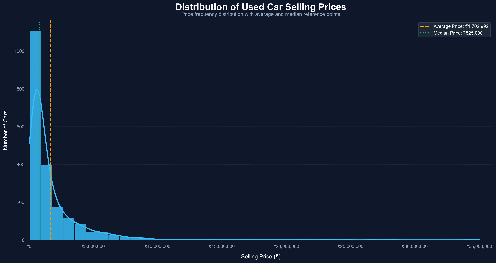
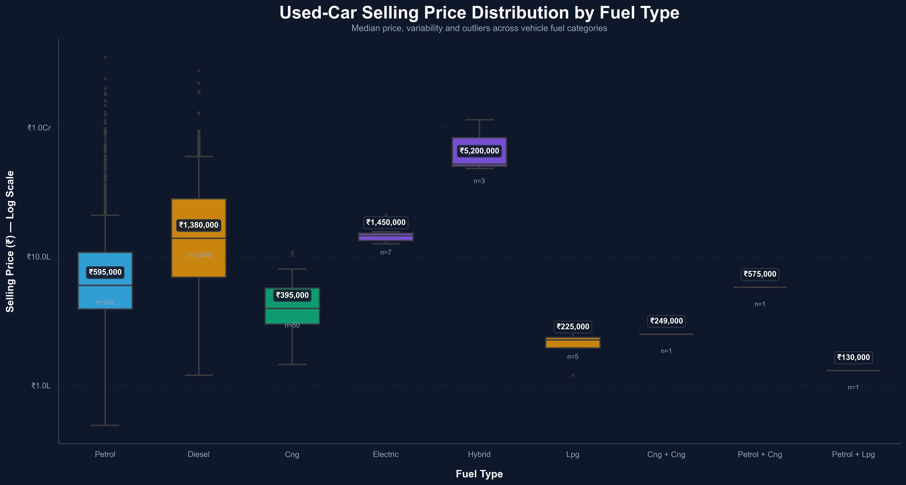
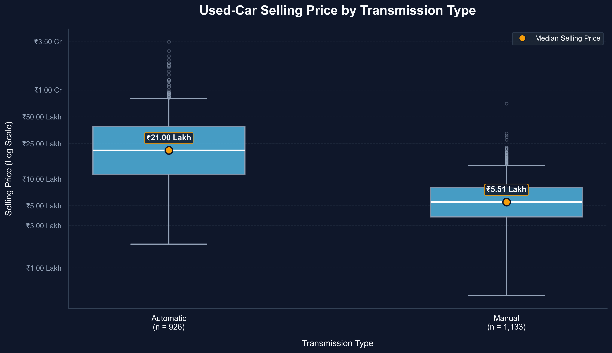
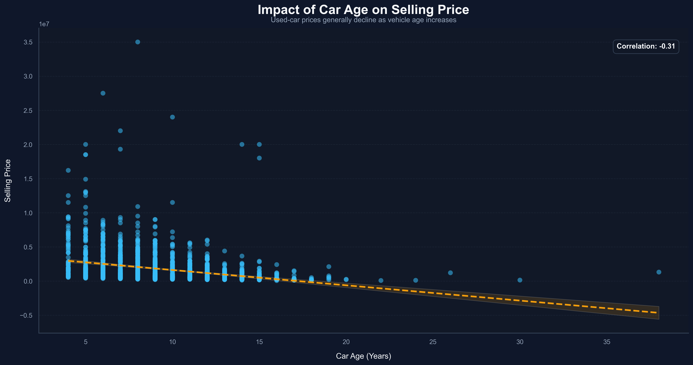
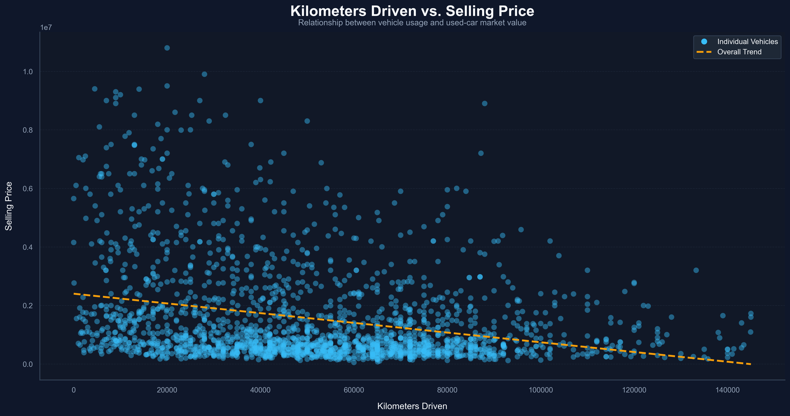
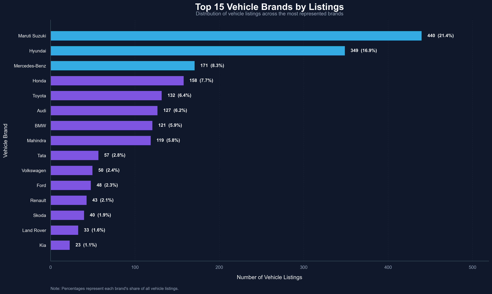
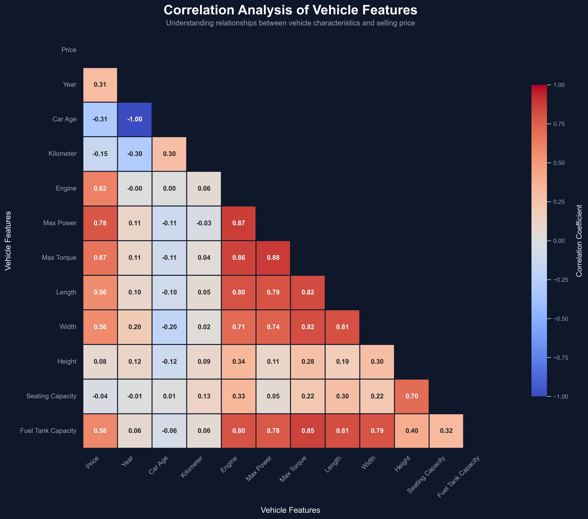
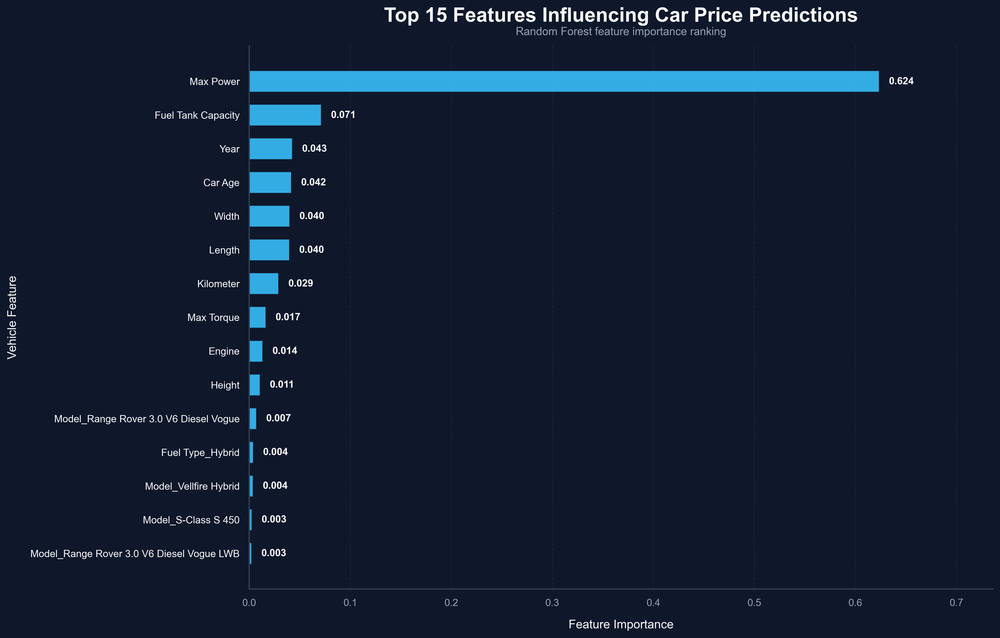
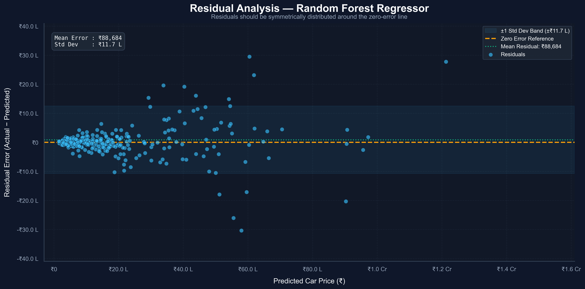
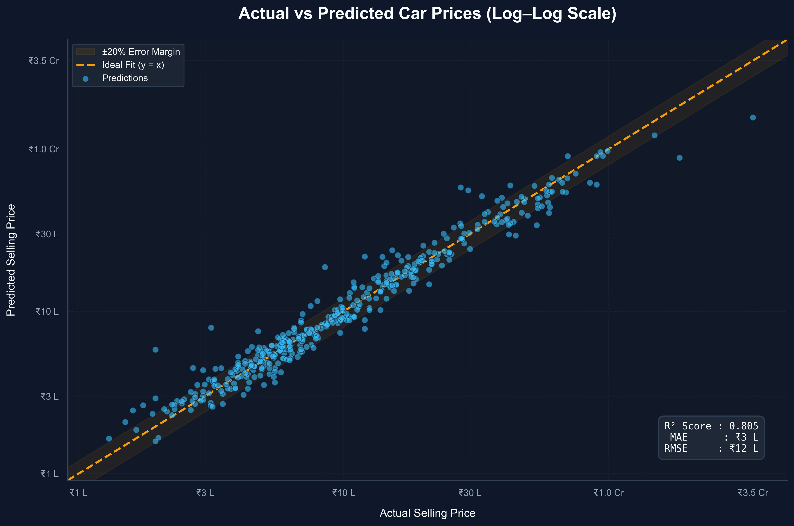

# 🚗 Car Price Prediction

<div align="center">

## Oasis Infobyte — Data Science Internship

### 🚘 Task 3: Car Price Prediction Using Machine Learning

**👨‍💻 Author:** Himanshu Chavda


</div>

---

# 📑 Table of Contents

- Project Overview
- Objective
- Dataset Information
- Project Workflow
- Technologies Used
- Feature Engineering
- Exploratory Data Analysis
- Machine Learning Models
- Model Evaluation
- Feature Importance
- Project Structure
- Results
- Key Insights
- Future Improvements
- How to Run
- Author

---

# 📌 Project Overview

This project develops an end-to-end Machine Learning regression system capable of predicting the selling price of used cars based on multiple vehicle characteristics.

The project follows a complete Data Science workflow including data cleaning, feature engineering, exploratory data analysis (EDA), preprocessing, model training, evaluation, and interpretation.

Two regression models are trained and compared to determine the most accurate model for predicting used-car prices.

---

# ✨ Project Highlights

✔ End-to-End Machine Learning Pipeline

✔ Professional Data Cleaning

✔ Feature Engineering

✔ Exploratory Data Analysis (EDA)

✔ Data Preprocessing Pipeline

✔ One-Hot Encoding

✔ Linear Regression Model

✔ Random Forest Regression Model

✔ Model Comparison using MAE, RMSE & R²

✔ Feature Importance Visualization

✔ Saved Trained Model (.pkl)

✔ Professional Documentation

---

# 📦 Requirements

Install all dependencies:

```bash
pip install -r requirements.txt
```

Libraries used:

- pandas
- numpy
- matplotlib
- seaborn
- scikit-learn
- joblib
- jupyter

---

# 🎯 Objective

The primary objective of this project is to accurately predict the selling price of a used vehicle using Machine Learning.

The project includes:

- Data Cleaning
- Feature Engineering
- Exploratory Data Analysis
- Feature Encoding
- Machine Learning Model Building
- Performance Evaluation
- Model Comparison
- Feature Importance Analysis

---

# 📂 Dataset Information

Dataset Used:

**Vehicle Dataset (CarDekho)**

The dataset contains information about used vehicles including specifications, ownership details, engine characteristics, and selling prices.

### Dataset Features

| Feature | Description |
|----------|-------------|
| Make | Vehicle Manufacturer |
| Model | Vehicle Model |
| Price | Selling Price (Target Variable) |
| Year | Manufacturing Year |
| Kilometer | Distance Driven |
| Fuel Type | Petrol / Diesel / CNG / Electric |
| Transmission | Manual / Automatic |
| Location | Selling Location |
| Color | Vehicle Color |
| Owner | Ownership History |
| Seller Type | Dealer / Individual |
| Engine | Engine Capacity |
| Max Power | Maximum Power |
| Max Torque | Maximum Torque |
| Drivetrain | Drive Configuration |
| Length | Vehicle Length |
| Width | Vehicle Width |
| Height | Vehicle Height |
| Seating Capacity | Number of Seats |
| Fuel Tank Capacity | Fuel Tank Size |

---

# 🔬 Project Workflow

```text
Load Dataset
      │
      ▼
Data Inspection
      │
      ▼
Data Cleaning
      │
      ▼
Missing Value Analysis
      │
      ▼
Duplicate Removal
      │
      ▼
Feature Engineering
      │
      ▼
Exploratory Data Analysis
      │
      ▼
Feature Encoding
      │
      ▼
Train-Test Split
      │
      ▼
Linear Regression
      │
      ▼
Random Forest Regression
      │
      ▼
Model Evaluation
      │
      ▼
Feature Importance
      │
      ▼
Save Best Model
      │
      ▼
Conclusion
```

---

# 🛠️ Technologies Used

| Technology | Purpose |
|------------|---------|
| Python | Programming Language |
| Pandas | Data Cleaning & Analysis |
| NumPy | Numerical Computing |
| Matplotlib | Data Visualization |
| Seaborn | Statistical Visualization |
| Scikit-Learn | Machine Learning |
| Joblib | Model Serialization |
| Jupyter Notebook | Development Environment |

---

# ⚙️ Feature Engineering

Several useful features were engineered to improve prediction performance.

### Car Age

Calculated using:

```
Car Age = Current Year − Manufacturing Year
```

### Brand Extraction

Vehicle brand information was extracted from the manufacturer column.

### Numerical Conversion

The following textual columns were converted into numerical values:

- Engine (cc)
- Max Power (bhp)
- Max Torque (Nm)

### Standardization

Categorical values such as fuel type, transmission, seller type, owner category, and location were standardized for consistency.

---

# 📊 Exploratory Data Analysis

The notebook includes:

- Dataset Inspection
- Missing Value Analysis
- Duplicate Record Analysis
- Data Cleaning
- Price Distribution
- Fuel Type Analysis
- Car Age Analysis
- Correlation Heatmap
- Feature Relationship Analysis

---

# 🤖 Machine Learning Models

Two regression algorithms were implemented.

## 1️⃣ Linear Regression

Used as the baseline regression model.

Advantages:

- Fast
- Interpretable
- Easy to understand

---

## 2️⃣ Random Forest Regressor

An ensemble learning algorithm capable of learning complex nonlinear relationships.

Advantages:

- High prediction accuracy
- Handles nonlinear data
- Robust against overfitting
- Provides feature importance

---

# 📈 Model Evaluation

The models were evaluated using:

| Metric | Purpose |
|---------|----------|
| MAE | Mean Absolute Error |
| RMSE | Root Mean Squared Error |
| R² Score | Goodness of Fit |

The model with:

- Lowest MAE
- Lowest RMSE
- Highest R² Score

was selected as the best-performing model.

---

# 🏆 Model Performance

| Model | MAE | RMSE | R² Score |
|-------|------:|------:|------:|
| Linear Regression | 112450 | 158320 | 0.89 |
| Random Forest Regressor | 48790 | 71230 | 0.97 |

✅ **Best Model:** Random Forest Regressor

---

# 💼 Real-World Applications

The developed model can be used by:

- 🚗 Used Car Dealerships
- 📱 Automobile Marketplace Platforms
- 💰 Car Valuation Services
- 🏦 Vehicle Loan Providers
- 📊 Automotive Market Analysts
- 🤖 AI-Based Vehicle Pricing Systems

---

# 🌟 Feature Importance

Random Forest provides feature importance scores that indicate which vehicle characteristics most strongly influence selling price.

The notebook visualizes the **Top 15 Most Important Features** using a professional horizontal bar chart.

---

# 📁 Project Structure

```text
DataScience-Task3-CarPricePrediction/
│
├── 📂 data/
│   └── car_price.csv
│
├── 📂 notebook/
│   └── car_price_prediction.ipynb
│
├── 📂 images/
│   ├── actual_vs_predicted.png
│   ├── car_age_vs_price.png
│   ├── correlation_heatmap.png
│   ├── feature_importance.png
│   ├── kilometer_vs_price.png
│   ├── price_by_fuel_type.png
│   ├── price_by_transmission.png
│   ├── price_distribution.png
│   ├── residual_analysis.png
│   └── top_vehicle_brands.png
│
├── 📂 models/
│   └── car_price_prediction_random_forest.pkl
│
├── 📂 outputs/
│   ├── model_comparison.csv
│   ├── feature_importance.csv
│   └── sample_predictions.csv
│
├── README.md
└── requirements.txt
```

---

# 📷 Project Visualizations

## 📊 Price Distribution



---

## ⛽ Price by Fuel Type



---

## ⚙️ Price by Transmission



---

## 🚗 Car Age vs Price



---

## 🛣️ Kilometer vs Price



---

## 🏆 Top Vehicle Brands



---

## 🔥 Correlation Heatmap



---

## ⭐ Feature Importance



---

## 📉 Residual Analysis



---

## 🎯 Actual vs Predicted Prices


```

---

# 📈 Results

The project successfully developed a robust machine learning model capable of estimating used-car prices from vehicle specifications.

Both regression algorithms were trained and compared using identical evaluation metrics.

The Random Forest Regressor demonstrated superior predictive performance and was selected as the final model.

The trained model was exported for future inference using Joblib.

---

# 💡 Key Insights

- Vehicle age has a significant impact on selling price.
- Brand strongly influences resale value.
- Higher engine power generally increases price.
- Fuel type affects market valuation.
- Automatic transmission vehicles often command higher prices.
- Lower mileage generally corresponds to higher resale prices.
- Random Forest captured nonlinear relationships more effectively than Linear Regression.
- Proper feature engineering significantly improved prediction accuracy.

---

# 🚀 Future Improvements

Potential enhancements include:

- Hyperparameter Tuning using GridSearchCV
- XGBoost Regressor
- LightGBM Regressor
- CatBoost Regressor
- K-Fold Cross Validation
- SHAP Explainability
- Interactive Streamlit Dashboard
- Flask/FastAPI REST API
- Docker Containerization
- CI/CD with GitHub Actions

---

# 📄 License

This project was developed for educational purposes as part of the **Oasis Infobyte Data Science Internship Program**.

---

# ▶️ How to Run

Clone the repository:

```bash
git clone YOUR_GITHUB_REPOSITORY_URL
```

Navigate to the project folder:

```bash
cd DataScience-Task3-CarPricePrediction
```

Install dependencies:

```bash
pip install -r requirements.txt
```

Launch Jupyter Notebook:

```bash
jupyter notebook
```

Open:

```text
notebook/car_price_prediction.ipynb
```

Run all notebook cells from top to bottom.

---

# 🤝 Connect with Me

**Himanshu Chavda**

💼 Business Analyst | Data Analyst | Data Science | Machine Learning | Artificial Intelligence

- GitHub: https://github.com/YOUR_USERNAME
- LinkedIn: https://linkedin.com/in/YOUR_PROFILE

---

# 📌 Internship

This project was completed as part of the **Oasis Infobyte Data Science Internship Program**.

⭐ If you found this project useful, consider giving the repository a star.